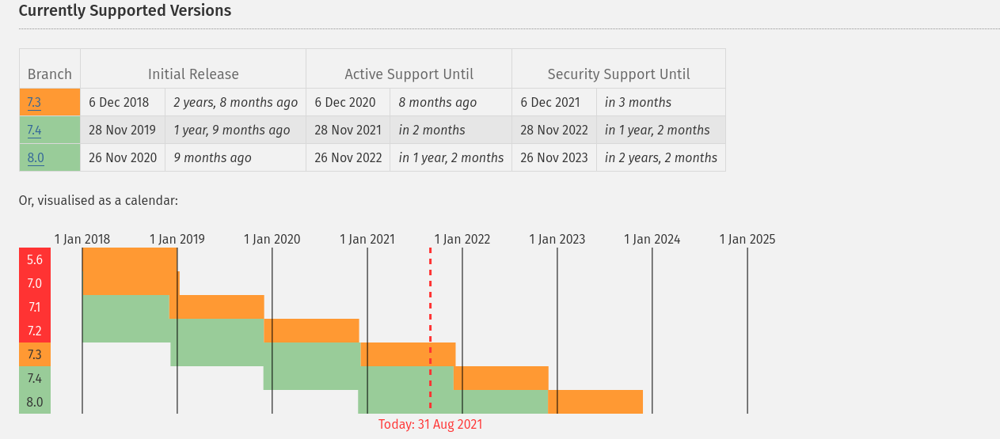

# EvalBook - Core

EvalBook Core peut s'installer sur un serveur léger et permet aux écoles belges, sans distinction de réseau de :

    - Gérer des évaluations
    - Atrribuer des notes à ces évaluations

EvalBook Core permet également la généartion d'un bulletin pour chaque élève inscrit dans le système, la création du bulletin fait partie 
du module **EvalBook Report** qui est installé d'office.

## Installation

### Serveurs
EvalBook peut s'installer sur un serveur de type Linux, peu importe la distribution

### Pré-requis
Pour installer EvalBook Core sur votre serveur, les extentions suivantes doivent etre installées:
 
 * ext-iconv
 * ext-ctype
 * PHP >= 8.0
 * pdo_mysql  (si mysql ou mariadb choisi en tant que système de gestion de base de données)
 * pdo_sqlite (si sqlite choisi en tant que système de gestion de base de données)
 * intl

Vous ne devriez pas avoir de soucis avec ces dépendances sur un serveur mutualisé, si vous avez un serveur dédié ou un VPS, pensez à installer ces extensions avant de procéder à l'installation

### Choix de la version de PHP.
La version de PHP compatible avec EvalBook est la **>= 8.0**, bien que certains gros hébergeurs ne supportent pas encore PHP8.0,
nous avons fait le choix de la stabilité en choisissant une version supportée sur le long terme.

Si vous souhaitez connaître un hébergeur performant et supportant PHP8.0, contactez nous, nous serions ravis de vous aider !

Plus d'informations sur les [version supportées de PHP](https://www.php.net/supported-versions.php)

### Installation classique

## Contribuer

### Traduire
Nous ne parlons pas néerlandais, si vous êtes néérlandophone, professeur de néerlandais ou polyglote :-) , sentez vous libre de nous aider dans les traductions, nous mettrons à votre disposition une interface simple vous permettant de nous aider sans vous encombrer :-)
 Vous ne devrez faire **aucune installation** !

### Tester
Si vous le souhaitez et si vous travaillez dans l'enseignement, peu importe votre poste, sentez-vous libre de nous demander un accès à la plateforme de test afin de nous aider à identifier tout bug critique ou non. Nous sommes constamment en recherche de testeurs afin d'améliorer la qualité de cet outil open source gratuit.

### Corriger
Vous avez trouvé, et corrigé un bug ? Envoyez nous une PR ! Vous avez trouvé une faute d'orthographe ? Nous ne sommes pas des machines, et apprécierions que vous nous le fassiez savoir :-)

### Coder
Toute aide est la bienvenue, sentez-vous libre de cloner le projet et de proposer des **Pull Requests**, nous serions ravis de les examiner et de les intégrer dans le projet si ils correspondent à la philosophie de EvalBook.

### Financer
Nous sommes en recherche de sponsors et de contributeurs afin de pouvoir consacrer plus de temps sur ce projet, mais aussi dans le but de pouvoir financer les différents serveurs dont nous avons besoin pour cet outil.
Vous souhaitez nous sponsoriser ou contribuer financièrement au développement ? Nous en serions ravis, contactez nous !

## Support

### Modalités de support

## Documentation développeurs

De la documentation basique pour les contributeurs est disponible dans le dossier **_doc** à la racine du projet.

Pour le README développeurs, c'est [par ici](_doc/technique/README_DEV.md).

